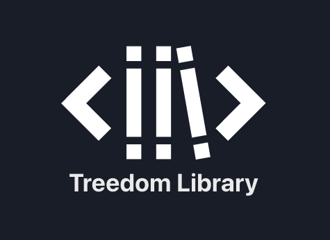
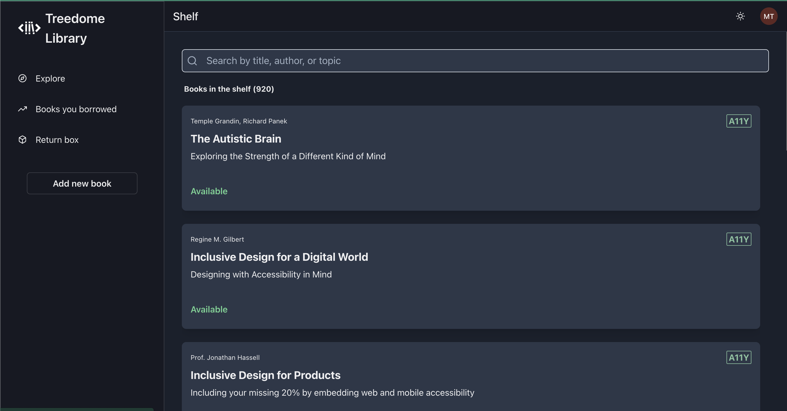
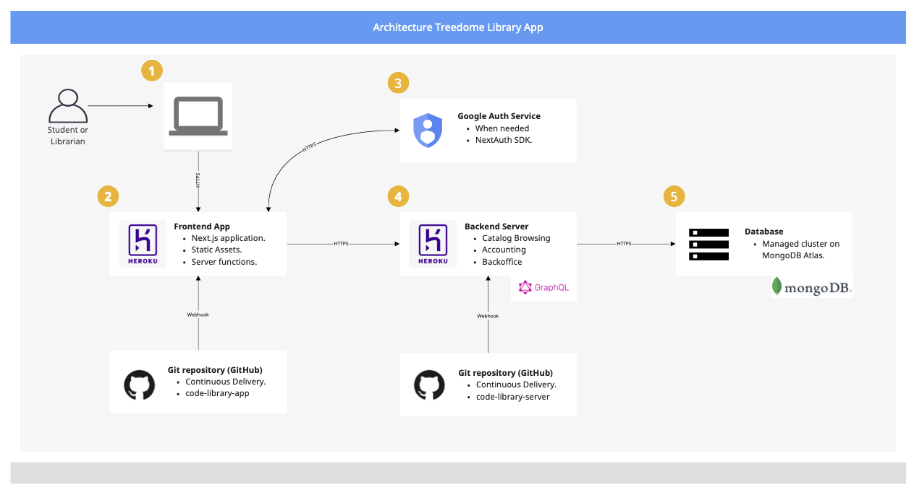

<p align="center">
  <a
    href="https://code-library-client-swguw3y6sa-ey.a.run.app/"
    target="_blank"
  >
    
  </a>
</p>


This is the UI of CODE's Library Management App.
It's an ongoing development taken by students at CODE University of Applied Sciences.
The library is named after the famous Treedome of SpongeBob SquarePants, which portraits the small size of our physical installation.

You can watch a short demo of the application [on YouTube](https://youtu.be/GnAkbk2cvq8).

## Table of Contents

- [Technologies](#technologies)
- [System Requirements](#system-requirements)
- [Installation Instructions](#installation-instructions)
- [Folder Structure](#folder-structure)
- [Architecture Overview](#architecture-overview)
- [Deployments](#deployment-workflows)

## Demo

<p align="center">
  <a
    href="https://youtu.be/GnAkbk2cvq8"
    target="_blank"
  >
    
  </a>
</p>

## Technologies

The application is written using the following stack.

- [Next.js](https://nextjs.org/)
- [Chakra UI](https://chakra-ui.com/)
- [TypesScript](https://www.typescriptlang.org/)
- [Apollo GraphQL](https://www.apollographql.com/)

## System Requirements

- Docker.
- Docker Compose.
- Google Cloud SDK.
- Node.js 16 (we recommend using `nvm` to support multiple Node.js versions)

## Installation Instructions

Just before we get started, make sure you are running Node 16.

```bash
node --version # should output something similar to v16.x.x
```

In case you are using nvm, switch to the right version by typing the following command.

```bash
nvm use 16
```

Now that we know we are running on the right environment, let's sping up the app.

### Developing with the last stable release of the CODE Library's Server

```bash
make start
```

By now you should be able to open [http://localhost:3000](http://localhost:3000) in your browser to see the application running.

## Folder Structure

To make it easy for new developers to navigate through our codebase, we provided you with a short explanation on why we split our code the way we do.

In a nutshell, our application is organized as follows.

```bash
  src/
     components/ Presentational components
     pages/ Page components (Next.js convention for file-based routing)
     hooks/ Custom React Hooks
     helpers/ Helper functions used across the app
     services/ External APIs integrations
```

For a more detailed exaplanation, navigate to the most relevant section.

- [Components](./src/components/README.md)
- [Hooks](./src/hooks/README.md)
- [Helpers](./src/helpers/README.md)
- [Services](./src/services/README.md)

## Architecture Overview

Please click on the diagram below to access the full interactive diagram.

<p align="center">
  <a
    href="https://miro.com/app/board/uXjVOiWfulk=/?share_link_id=628581242894"
    target="_blank"
  >
    
  </a>
</p>

## Deployment workflows

We have two environments for deployment: staging and production. The first is running on Heroku, while the second runs on Google Cloud Run. Each one is triggered based on the name of the branch being pushed to the repository.

- Pushes to main will trigger a deployment to the staging environment.
- Creating or updating a pull requests will also trigger a deployment to the staging environment.
- Tags prefixed with a "v" (i.e., v1.0.0) will trigger a deployment to the production environment.
